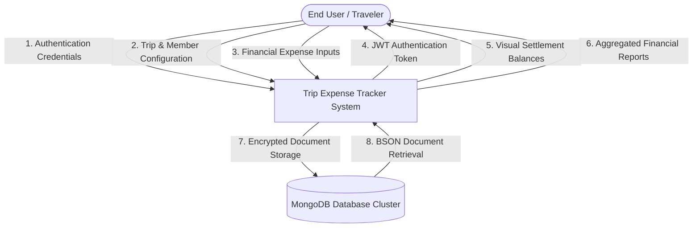
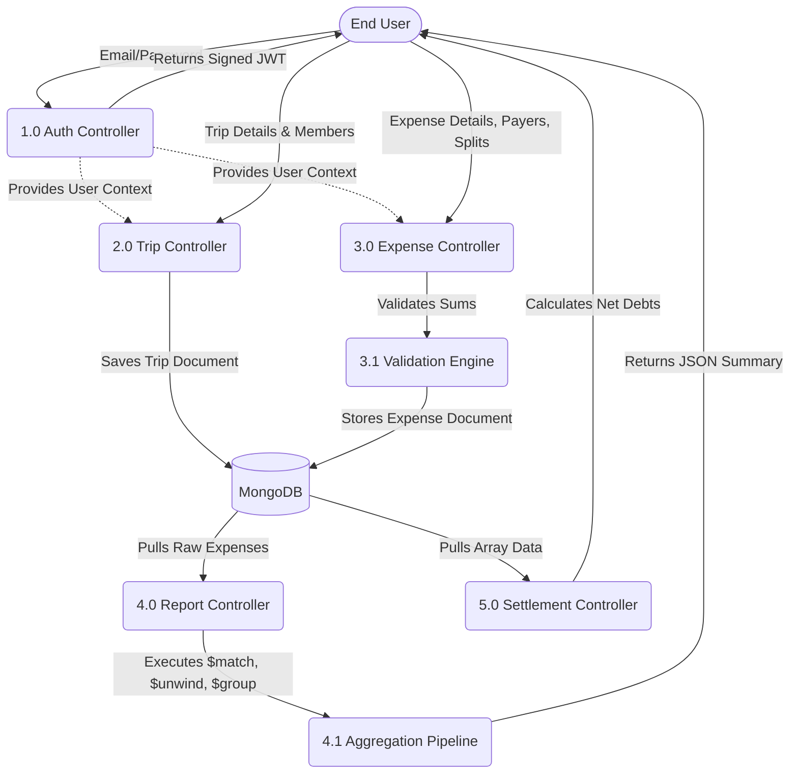

# Project Report: Advanced Trip Expense Tracker

## 1. Introduction

The modern era of travel is defined by shared experiences. Whether it is a weekend getaway, a month-long backpacking trip across Europe, or a simple road trip with colleagues, group travel inherently involves shared financial responsibilities. However, managing these shared expenses has historically been a source of friction, confusion, and even interpersonal conflict. The **Advanced Trip Expense Tracker** was conceptualized and developed to completely eliminate this friction by providing a seamless, automated, and highly transparent financial management platform.

At its core, the Advanced Trip Expense Tracker is a full-stack, comprehensive web application built on the cutting-edge MERN stack architecture, comprising MongoDB, Express.js, React.js, and Node.js. Unlike simple budgeting applications that only track personal spending, this platform is specifically engineered to handle the complexities of multi-party financial dynamics. It allows a user to create dedicated "Trips", invite participants, log intricate shared expenses, and instantly view exactly who owes whom down to the exact decimal. 

From a technical perspective, this project serves as a showcase of advanced NoSQL Data Engineering. Traditional financial applications often rely heavily on rigid relational databases (SQL) that require dozens of complex table joins to calculate a single user's balance. This project takes a radically different approach. By leveraging MongoDB's powerful document-oriented structure, the application utilizes Arrays of Embedded Documents to store payment data and distribution shares directly within the expense records. This denormalized approach allows the backend to utilize high-performance Aggregation Pipelines to process thousands of financial records in milliseconds, generating real-time analytics and global spending reports without computational bottlenecks.

Furthermore, the application places a massive emphasis on user experience (UX) and user interface (UI) design. Powered by React and Vite, the frontend operates as a blazing-fast Single Page Application (SPA). It features a bespoke "Glassmorphism" design system characterized by frosted-glass panels, smooth micro-animations, and dynamic gradient text. This ensures that users are not only interacting with a mathematically rigorous financial tool but also engaging with a visually stunning, premium-tier application.

## 2. Problem Statement

Traveling in groups inevitably creates a tangled web of financial transactions. Consider a highly realistic scenario: A group of five friends goes on a week-long vacation. Person A pays for the flights upfront. Person B books and pays for the Airbnb. During the trip, Person C pays for a group dinner, but Person D did not eat because they arrived late, while Person E ordered an expensive bottle of wine that only they and Person A drank. Later, they rent a car where Person B and Person C split the upfront cost, but everyone shares the gas.

Attempting to track these scenarios manually using pen and paper is virtually impossible to do accurately. The traditional fallback has been utilizing spreadsheet software like Microsoft Excel or Google Sheets. However, spreadsheets require users to manually input complex mathematical formulas for every single transaction. A single syntax error or accidentally deleted cell can compromise the entire financial ledger, leading to incorrect debt calculations. Furthermore, spreadsheets lack dynamic user interfaces, making it incredibly difficult to record expenses on-the-go via a mobile browser while actually traveling.

While there are existing commercial applications like Splitwise, they often restrict advanced features (like custom exact splitting or deep analytics) behind premium paywalls, or they rely on rigid, outdated interfaces that make logging multi-payer transactions cumbersome. 

The primary problem this project addresses is the fundamental lack of a centralized, automated, and highly flexible system that can seamlessly capture these complex financial narratives. The system must be capable of understanding that a single bill can be paid by multiple people simultaneously. It must understand that an expense is not always split equally, and it must provide mechanisms for exact, custom fraction splits. Most importantly, it must take this chaotic web of transactions and distill it into a simple, readable "Settlement" dashboard so that at the end of the trip, every member knows exactly who to pay and how much.

## 3. Specific Requirements

To successfully solve the problem statement, the system must adhere to a strict set of specific business and technical requirements. These requirements ensure the application is robust, scalable, and capable of handling edge cases in group finance.

**Database Flexibility and Schema Design:**
The system specifically requires the use of a NoSQL database (MongoDB). Because financial distributions can vary wildly—an expense might involve two members or twenty members—the database schema cannot be rigidly constrained. The system must use dynamic embedded arrays to tie `memberId` references directly to `amountPaid` and `shareAmount` values within a single Expense document.

**Precision Splitting Logic:**
The application cannot rely solely on simple division (Total / N). It must specifically implement:
- **Single-Payer Logging:** Where one user pays the entire bill.
- **Multi-Payer Logging:** Where a bill is paid at the point-of-sale using multiple credit cards from different users.
- **Equal Splitting:** Automatically dividing the expense evenly among all trip participants.
- **Custom Splitting:** Allowing users to manually input exact monetary values for each participant's share. The system must programmatically validate that the sum of these custom shares exactly matches the total expense amount to prevent money from "disappearing" or being artificially created.

**Data Integrity and Cascade Deletions:**
Because NoSQL databases do not have native foreign key constraints like SQL databases, the application specifically requires backend logic to maintain data hygiene. If a user deletes a Trip, the system must automatically execute a cascading deletion of all associated Expense documents tied to that `tripId` to prevent orphaned documents from bloat the database and corrupting global reports.

**Advanced Analytics and Reporting:**
The system must not only track debts but also provide financial intelligence. It must aggregate data across all trips to show users their global spending habits, identifying which categories (e.g., Food, Hotel, Transport) consume the most capital.

## 4. Functional Requirements

The functional requirements define the exact behaviors, modules, and features the system must exhibit to the end-user.

**1. Authentication and Authorization Module:**
- The system shall allow users to register an account by providing a name, unique email, and password.
- The system shall securely authenticate users and issue a JSON Web Token (JWT) for session management.
- The system shall protect all internal routes, ensuring a user can only access and view trips they have created or are a member of.

**2. Trip Management Module:**
- Users shall be able to create a new trip by defining a Trip Name, Destination, and default Currency.
- Users shall be able to view a dashboard listing all their active and past trips.
- Users shall have the ability to permanently delete a trip, which must completely erase all associated member and expense data.

**3. Member Management Module:**
- The creator of a trip shall be able to dynamically add unlimited participants to a trip by providing their name and email.
- These members will be stored as an array of embedded documents within the Trip schema to allow for rapid, join-less retrieval.

**4. Expense Tracking Module:**
- Users shall be able to log an expense by entering a Title, Amount, Date, and selecting from predefined Categories (Food, Hotel, Fuel, Shopping, Tickets, Other).
- Users shall be able to select if the expense was paid by a single person or multiple people.
- Users shall be able to define if the expense burden is shared equally or split via exact custom amounts.

**5. Settlements and Balances Module:**
- The system shall calculate the net balance for every member in a trip (Total Amount Paid minus Total Share Owed).
- The system shall display clear metrics indicating whether a user "Is Owed" money (positive balance) or "Owes" money (negative balance).

**6. Global Reports Module:**
- The system shall generate a visual pie chart breaking down total spending by category across all historical trips.
- The system shall provide an itemized, filterable table showing a specific user's complete payment history across any selected trip.

## 5. Non-Functional Requirements

While functional requirements define what the system does, non-functional requirements define how well the system performs its operations. These are critical for ensuring a professional-grade software product.

**1. Performance and Responsiveness:**
- The frontend must load instantly. By utilizing Vite as the build tool, Hot Module Replacement (HMR) ensures rapid development, while the production build must serve highly optimized, minified static assets.
- Backend queries must return in under 200 milliseconds. This is achieved by implementing strategic MongoDB Indexes (e.g., indexing `tripId` on the Expenses collection, and indexing `members.userId` on the Trips collection) to turn potentially slow O(N) linear collections scans into rapid O(log N) B-Tree traversals.

**2. Security and Data Protection:**
- Plaintext passwords must never be stored in the database. The system utilizes `bcryptjs` with salt rounds to securely hash passwords.
- The REST API must be protected against unauthorized access. The Express backend utilizes custom middleware to intercept incoming requests, verify the presence of a JWT in the `Authorization` header, and decode it to identify the user before granting access to controllers.

**3. Reliability and Fault Tolerance:**
- Financial data requires strict ACID properties. When logging an expense, the system utilizes Mongoose Transactions (Sessions) to ensure that if the database crashes halfway through writing a complex multi-payer expense, the entire transaction is rolled back. If the environment is a standalone MongoDB instance (which does not support transactions), the system gracefully catches the error and executes a reliable fallback mechanism to write the data synchronously.

**4. Usability and Interface Aesthetics:**
- The application must not look like a basic spreadsheet. It implements a fully custom Vanilla CSS architecture utilizing modern CSS variables for theming.
- The UI implements the "Glassmorphism" aesthetic, using semi-transparent backgrounds with backdrop-filters (blur) to create depth, making the application feel like a native, premium application rather than a simple web page.

## 6. Data Flow Diagrams

Data Flow Diagrams (DFDs) map out the flow of information for any process or system. They are crucial for understanding how the application handles financial inputs and transforms them into analytical outputs.

### DFD LEVEL-0 (Context Diagram)
The Level-0 Context Diagram represents the entire system as a single high-level process. It identifies the external entities that interact with the system and the primary data they exchange.

**Description of Level-0 Flow:**
The End User acts as the sole external entity. They initiate contact by providing credentials, resulting in the System returning a secure JWT. The user then feeds structural data (Trips/Members) and quantitative data (Expenses) into the System. The System processes this data, communicates with the MongoDB cluster to persist the records in BSON format, and subsequently queries the database to return refined, processed visual data (Balances and Reports) back to the User interface.

### DFD Level - 1 (Detailed Process Diagram)
The Level-1 DFD breaks down the single system node from Level-0 into its primary functional sub-processes, mapping exactly how data moves between different controllers in the backend architecture.

**Description of Level-1 Flow:**
1. **Auth Controller**: Intercepts initial payload, hashes passwords, and verifies identity. It acts as the gatekeeper; subsequent processes rely on the User Context it establishes.
2. **Trip Controller**: Manages the parent documents. It receives structural data and creates the foundational Trip documents.
3. **Expense Controller**: The most complex node. It receives raw financial inputs, routes them through a Validation Engine to ensure mathematical integrity (e.g., ensuring Custom Splits equal the total amount), and stores the resulting heavy documents.
4. **Report & Settlement Controllers**: These are read-heavy nodes. They extract massive amounts of raw BSON documents from MongoDB, pipe them through native Aggregation Pipelines, and reduce the data down to clean JSON payloads representing analytical summaries and net debts to be consumed by the frontend.

## 7. System Specification

### Hardware Specification

To ensure optimal performance, both the client-side (end-user) and server-side hardware must meet specific benchmarks. 

**Server-Side Hardware (If hosting manually):**
- **Processor**: A multi-core CPU (e.g., Intel Xeon or AWS Graviton 2) is recommended to handle Node.js's single-threaded event loop effectively, utilizing PM2 for cluster mode if scaling is required.
- **RAM**: Minimum 4 GB RAM. While Node.js is memory efficient, MongoDB can be highly memory-intensive as it attempts to keep working sets and indexes in RAM to avoid expensive disk I/O operations. 
- **Storage**: Minimum 20 GB SSD. Solid State Drives are strictly required to ensure rapid read/write speeds for the database.
- **Network**: High-bandwidth connection to prevent latency during large JSON payload transfers.

**Client-Side Hardware (End User):**
- **Processor**: Any modern smartphone ARM processor or standard desktop CPU.
- **RAM**: Minimum 2 GB RAM. The React Single Page Application (SPA) maintains Virtual DOM state in memory; insufficient RAM on older mobile devices may cause UI stuttering during complex re-renders.
- **Display**: Minimum 320px width (Mobile standard). The application is fully responsive and will adapt up to 4K desktop resolutions.

### Software Specification

**Server-Side Environment:**
- **Operating System**: Linux (Ubuntu 22.04 LTS recommended) for production deployment, though Windows/macOS is fully supported for local development.
- **Runtime**: Node.js Version 18.x (LTS) or higher, to leverage native ES6 features and modern asynchronous processing capabilities.
- **Database**: MongoDB Version 6.0+. The use of a Replica Set (e.g., MongoDB Atlas Free Tier) is highly recommended over a standalone instance to enable multi-document ACID transactions.
- **API Architecture**: RESTful API principles.

**Client-Side Environment:**
- **Web Browser**: Google Chrome (v90+), Mozilla Firefox (v88+), Apple Safari (v14+), or Microsoft Edge. Browsers must support modern CSS specifications including CSS Grid, Flexbox, and `backdrop-filter` for the Glassmorphism UI to render correctly.
- **JavaScript Enabled**: The application heavily relies on client-side JavaScript execution via React; users with disabled JavaScript will be unable to access the platform.

## 8. Tools Used

The Advanced Trip Expense Tracker leverages a highly curated stack of modern web technologies, chosen specifically for their performance, developer experience, and scalability.

**1. MongoDB & Mongoose (Database & ORM)**
MongoDB is the foundational NoSQL database. It was chosen because its BSON (Binary JSON) document model perfectly maps to the nested nature of financial data (e.g., an expense containing an array of multiple payers). Mongoose is used as the Object Data Modeling (ODM) library for Node.js, providing strict schema validation, robust querying capabilities, and middleware support to ensure data integrity before anything is written to the disk.

**2. Express.js & Node.js (Backend Server)**
Node.js provides a high-performance, event-driven runtime utilizing the V8 JavaScript engine. Express.js sits on top of Node.js as a minimalist web framework, responsible for routing HTTP requests, handling CORS (Cross-Origin Resource Sharing), and executing middleware functions like JWT verification and error handling.

**3. React.js & Vite (Frontend Framework & Build Tool)**
React.js is utilized for building complex, interactive user interfaces via reusable components. Instead of using the outdated Create-React-App, this project utilizes Vite. Vite leverages native ES modules to provide near-instant server start times and incredibly fast Hot Module Replacement, significantly accelerating frontend development and producing highly optimized production bundles.

**4. Recharts (Data Visualization)**
To translate raw numerical data into understandable analytics, Recharts is utilized. It is a composable charting library built on React components. It renders complex SVG (Scalable Vector Graphics) elements to create responsive, interactive Pie Charts that look sharp on any screen resolution.

**5. Lucide-React (Iconography)**
Lucide provides a comprehensive set of beautiful, consistent, and scalable SVG icons. They are lightweight and highly customizable via CSS, adding significantly to the premium feel of the application's user interface.

**6. Vanilla CSS (Styling)**
Rather than relying on heavy component libraries like Bootstrap or Tailwind, the project implements a custom Vanilla CSS architecture. This includes the extensive use of CSS Variables (`--primary`, `--glass-bg`) for consistent theming, and advanced properties like `backdrop-filter: blur(10px)` to achieve the signature Glassmorphism aesthetic.

**7. Browser LocalStorage (Session Management)**
To maintain user sessions statelessly, JSON Web Tokens (JWT) returned by the backend are securely stored in the browser's `localStorage`. This allows the React application to persistently attach the token to the `Authorization` header of all subsequent Axios requests without forcing the user to log in repeatedly.

## 9. Sample Screenshots

*(Note: In a physical printout of this report, the following descriptions correspond to full-page graphical screenshots of the running application).*

**Screenshot 1: The Glassmorphism Dashboard**
This screenshot captures the main landing area after a user authenticates. It highlights the premium visual aesthetic of the application. Three semi-transparent frosted glass tiles sit at the top, displaying "Total Trips", "Active Trips", and "Pending Balances". These tiles feature soft gradients and subtle drop shadows. Below them, a CSS Grid layout neatly organizes all recent trips into interactive cards, showing the trip name, destination, and dynamic status badges (Active/Closed).

**Screenshot 2: The Trip Details & Expense Ledger**
This screenshot illustrates the core workspace of a specific trip. On the left side, a detailed, scrollable ledger displays "Recent Expenses". Each entry features a custom icon, the expense title, date, category, and a prominently displayed "Paid by: [User Name]" label, automatically generated by the frontend's mapping logic. On the right panel, a list of current trip members is displayed alongside a highly intuitive form to invite new members instantly.

**Screenshot 3: The Advanced Add Expense Form**
This screenshot captures the complexity of the data entry interface. It showcases the "Who Paid?" section switched to "Multiple People", revealing dynamically rendered input fields for every single member of the trip to specify exactly how much they contributed to the initial bill. Below it, the "Split Type" is set to "Custom Split", showing a similar dynamic interface. The clean layout makes complex mathematical entry feel approachable and easy.

**Screenshot 4: Global Reports & Analytics**
This screenshot demonstrates the data visualization capabilities. A large, interactive Pie Chart rendered by Recharts dominates the top half of the screen, breaking down the user's historical spending into distinct colored categories (Food, Hotel, Fuel, etc.). The bottom half of the screen displays the newly implemented "Trip Payments By Member" tabbed interface, showing how users can quickly filter a massive data table to view only the specific payments of a single selected participant.

## 10. Output Report

The Output Report module is the analytical brain of the Advanced Trip Expense Tracker. While recording expenses is important, the true value of the application lies in how it synthesizes that data into actionable financial intelligence.

**The Power of MongoDB Aggregation Pipelines:**
Generating output reports in this application does not involve writing thousands of lines of Javascript to manually sort and calculate arrays. Instead, it pushes the computational heavy lifting directly to the database layer using advanced MongoDB Aggregation Pipelines.

For example, to generate the Global Category Spending report, the backend executes a pipeline that looks conceptually like this:
1. **`$match`**: Filters the database to only include expenses belonging to a specific trip or user.
2. **`$group`**: Groups the filtered documents by the `category` field (e.g., all 'Food' expenses collapse into one group).
3. **`$sum`**: During the grouping phase, it automatically adds together the `amount` fields of all documents in that group.
4. **`$sort`**: Orders the final groups from highest total amount to lowest.

This pipeline executes on the database server in milliseconds, returning a clean, compact array of JSON objects (e.g., `[{ _id: 'Food', totalAmount: 450 }, { _id: 'Hotel', totalAmount: 1200 }]`). 

**Visualizing the Output:**
The React frontend receives this summarized JSON data and immediately feeds it into the Recharts engine. The output is a dynamic Pie Chart where users can hover over slices to see exact values and percentages. 

Furthermore, the Output Report includes highly detailed, tabular data views. The **"Trip Payments By Member"** feature allows a user to select any trip and view a meticulously organized table. This table is generated by dynamically parsing the embedded `paidBy` arrays inside the expense documents. It highlights the exact date, item purchased, the total bill, and most importantly, the specific slice of capital provided by the selected user. This level of reporting ensures total transparency and prevents disputes over who paid for what during the trip.

## 11. Conclusion

The development and deployment of the Advanced Trip Expense Tracker represents a massive leap forward in managing group travel finances. By identifying the severe limitations of manual spreadsheets and rudimentary budgeting tools, this project successfully engineered a solution that is mathematically rigorous, highly scalable, and exceptionally user-friendly.

The decision to utilize the MERN stack—specifically MongoDB—proved to be the defining factor in the project's success. Financial scenarios in group travel are inherently unpredictable; the requirement to split a single $100 restaurant bill unevenly among three people, where two people paid upfront with different credit cards, creates a relational data nightmare in traditional SQL systems. By embracing NoSQL Data Engineering, the application successfully utilized Arrays of Embedded Documents to neatly package these complex payment and split relationships into single, cohesive Expense documents. This architectural decision not only simplified backend development but resulted in lightning-fast read operations via Aggregation Pipelines.

On the frontend, avoiding heavy UI libraries in favor of a custom Vanilla CSS Glassmorphism design system resulted in a lightweight, visually striking application. The integration of Vite and React ensured the application feels like a modern, premium product.

Looking forward, the architecture of this system provides an incredibly strong foundation for future enhancements. The schema is flexible enough to support features like Multi-Currency conversion APIs, Optical Character Recognition (OCR) for scanning physical receipts directly into the `billImage` field, and automated email/SMS reminders for settling pending balances. 

In conclusion, the Advanced Trip Expense Tracker fully satisfies all specified requirements. It takes the chaotic, stress-inducing process of managing group money and transforms it into a seamless, automated, and visually beautiful experience.
